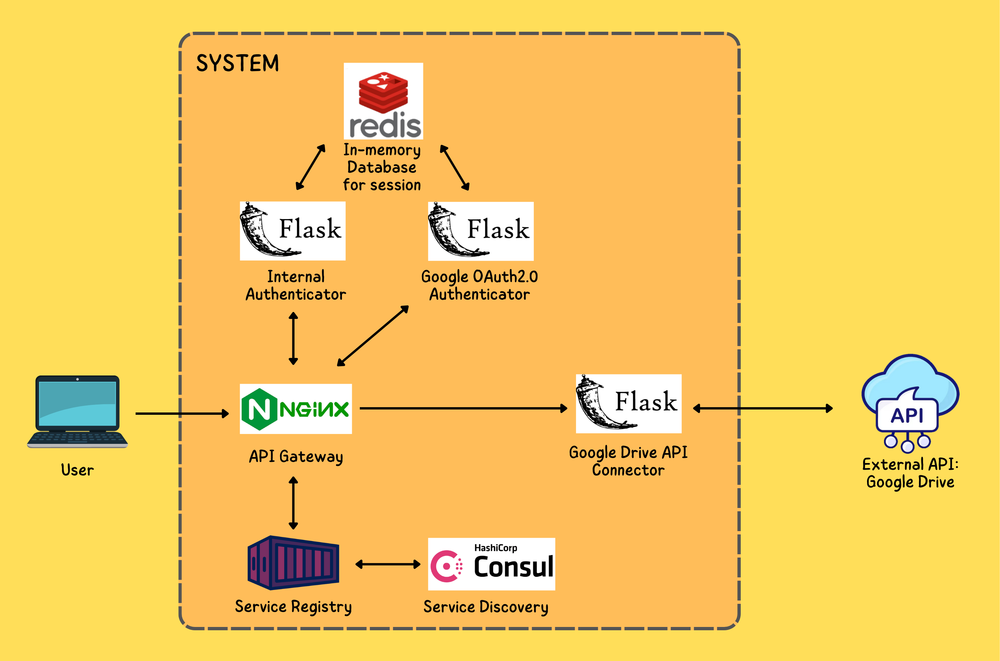

# Autenticazione di Google con OAuth2.0 per i servizi Google Drive

Questo progetto implementa l'autenticazione Google con OAuth2.0 per accedere ai servizi di Google Drive, tramite l'API pubblica.

## Indice
1. [Architettura](#architecture)
2. [Strumenti utilizzati](#tools)
3. [Installazione e utilizzo](#installation)

## <a name="architecture"></a> 1. Architettura 

Sono stati creati dei microservizi e ognuno di essi è stato incapsulato in un container Docker.


I microservizi presenti sono:
- ```API Gateway```: funge da unico punto di accesso per gestire e orchestrare le richieste API provenienti dai client o applicazioni; questo implica che tutte le richieste provenienti dall'esterno possono passare solo dal Gateway e i microservizi non sono invocabili direttamente;
- ```Service Registry```: funge da registro centralizzato per memorizzare informazioni sui servizi disponibili, come indirizzo IP e porta sui quali sono in esecuzione; supporta l'API Gateway nell'invocazione dei microservizi;
- ```Service Discovery```: funge da componente che "scopre" i microservizi all'interno dell'ambiente distribuito quindi è anche di support al registry;
- ```Internal Authenticator```: funge da autenticatore di richieste provenienti dall'esterno; ognuqualvolta che l'utente fa una richiesta di accesso a Google Drive API, questo microservizio controlla se l'utente è effettivamente autenticato a Google: in caso positivo, reindirizza l'utente direttamente al servizio richiesto, altrimenti lo reindirizza alla pagina di login;
- ```Google OAuth2.0 Authenticator```: funge da microservizio che gestisce il flow di autenticazione Google secondo il framework OAuth2.0;
- ```In-memory Database for session```: un database in-memory usato per salvare i dati di sessione;
- ```Google Drive API Connector```: funge da connettore all'API di Google Drive e offre quindi le operazioni di lettura e/o scrittura al proprio Drive.

### Le fasi
Di seguito sono illustrate le fasi tipiche:
1. L'utente di collega al sito web (in questo caso sarà https://localhost);
2. La richiesta verrà accolta dall'```API Gateway```, che renderizzerà la pagina principale;
3. Nella pagina principale all'utente viene data la possibilità di accedere al servizio di Google Drive tramite l'apposito tasto;
4. Nel momento in cui l'utente fa la richiesta; l'```API Gateway``` farà partire in automatico una sottorichiesta di autenticazione e autorizzazione verso il microservizio di ```Internal Authenticator```;
5. ```Internal Authenticator``` controlla se l'utente è autorizzato ad accedere controllando se ci sono i suoi dati in sessione (memorizzati ***cifrati*** nell'```In-memory Database```): se ci sono, ```Internal Authenticator``` restituisce ```status code 200 - OK``` all'```API Gateway``` ed esso reindirizzerà l'utente al servizio richiesto (```Google Drive API Connector```); se non ci sono, restituisce ```status code 401 - Unauthorized``` all'```API Gateway``` ed esso reindirizzerà l'utente alla pagina di login Google (```Google OAuth2.0 Authenticator```);
6. Dopo il login, l'utente potrà accedere ai servizi del proprio Google Drive.


## <a name="tools"></a> 2. Strumenti utilizzati
In questa sezione viene fatto un mapping tra il componente e lo strumento utilizzato per realizzarlo:
- ```API Gateway``` --> **```Nginx```** (cartella ```./docker/nginx-gateway```);
- ```Service Registry``` --> **```Registrator```** (immagine scaricata da [Docker Hub](https://hub.docker.com/r/gliderlabs/registrator));
- ```Service Discovery``` --> **```Consul```** (immagine scaricata da [Docker Hub](https://hub.docker.com/r/hashicorp/consul)): 
- ```Internal Authenticator``` --> **```Framework Flask per Python```** (cartella ```./docker/internal-auth```);
- ```Google OAuth2.0 Authenticator``` --> **```Framework Flask per Python```** (cartella ```./docker/google-auth```);
- ```In-memory Database for session``` --> **```Redis```** (immagine scaricata da [Docker Hub](https://hub.docker.com/_/redis));
- ```Google Drive API Connector``` --> **```Framework Flask per Python```** (cartella ```./docker/drive-api-conn```).



### NGINX
[NGINX](https://www.nginx.com/) è server web e reverse proxy open-source noto per la sua efficienza, affidabilità e basso utilizzo di risorse. Inizialmente sviluppato per risolvere problemi di concorrenza e scalabilità associati ad Apache, Nginx è diventato una scelta comune per gestire il traffico web, fungere da reverse proxy e svolgere diverse altre funzioni di servizio in ambienti server, come il load balancing.

### Registrator
[Registrator](https://github.com/gliderlabs/registrator) è un software progettato per semplificare la registrazione automatica di servizi in un ambiente distribuito. È spesso utilizzato in architetture basate su microservizi per automatizzare il processo di registrazione dei servizi.

### Consul
[Consul](https://www.consul.io/) è un software open-source sviluppato da HashiCorp che fornisce servizi di scoperta, configurazione e segmentazione della rete per applicazioni distribuite.

### Flask per Python
[Flask](https://flask.palletsprojects.com/en/3.0.x/) è un framework web leggero e estensibile scritto in Python. Fornisce le basi essenziali per la creazione di applicazioni web, lasciando agli sviluppatori la libertà di estenderlo con librerie e componenti aggiuntivi a seconda delle esigenze del progetto.

### Redis
[Redis](https://redis.io/) è un sistema di memorizzazione in-memory di tipo chiave-valore open-source. È noto per la sua velocità, affidabilità e versatilità. Redis può essere utilizzato come database, cache e message broker ma anche come storage per dati di sessione server-side.


## <a name="installation"></a> 3. Installazione e utilizzo
Per poter installare e usare il contenuto di questo progetto, è necessario avere Docker Desktop installato sul proprio dispositvo o semplicemente solo il Docker Engine.

Per creare le immagini e, successiamente, creare i container e avviarli, basterà:
1. clonare il presente repository sulla propria macchina;
2. avviare Docker;
3. posizionarsi nella cartella ```./docker``` da linea di comando ed eseguire il comando
```
docker compose up -d
```
Per usare il sistema, basterà collegarsi a https://localhost (HTTPS perché è stato inserito in NGINX un certificato self-signed) (essendo un certificato self-signed, il browser potrà segnalare un potenziale rischio ma si può ignorare).

La pagina principale mosterà dei tasti per
- Accedere ai servizi di Google Drive;
- Fare logout (cancellare la sessione);
- Revocare l'autorizzazione.

**DISCLAIMER 1:
Può succedere che, dopo l'esecuzione del comando appena menzionato, il container ```registrator``` (```service registry```) non si avvii subito, questo perché ha bisogno di instaurare una connessione con ```consul``` (```service discovery```) e non può farlo finché ```consul``` non è completamente avviato, perciò sarà necessario avviare ```registrator``` manualmente e per fare ciò basterà aspettare qualche secondo affinché ```consul``` si avvii completamente.
Inoltre, il gateway restituirà ```status code 500``` se si tenta di accedere al microservizio di Google Drive *senza* aver avviato ```registrator```.
Dopo aver avviato ```registrator```, il tutto dovrebbe iniziare a funzionare correttamente nel giro di un paio di secondi.**

**DISCLAIMER 2:
Per poter effettuare il flow OAuth2.0, è stato creato un progetto su Google Cloud e, per poter permettere l'accesso anche ai non-tester, il progetto è stato posto in modalità *produzione*. Essendo l'applicazione non "verificata" da Google, Google può mostrare un messaggio di warning - per questioni di sicurezza - ma permette comunque di procedere.**


